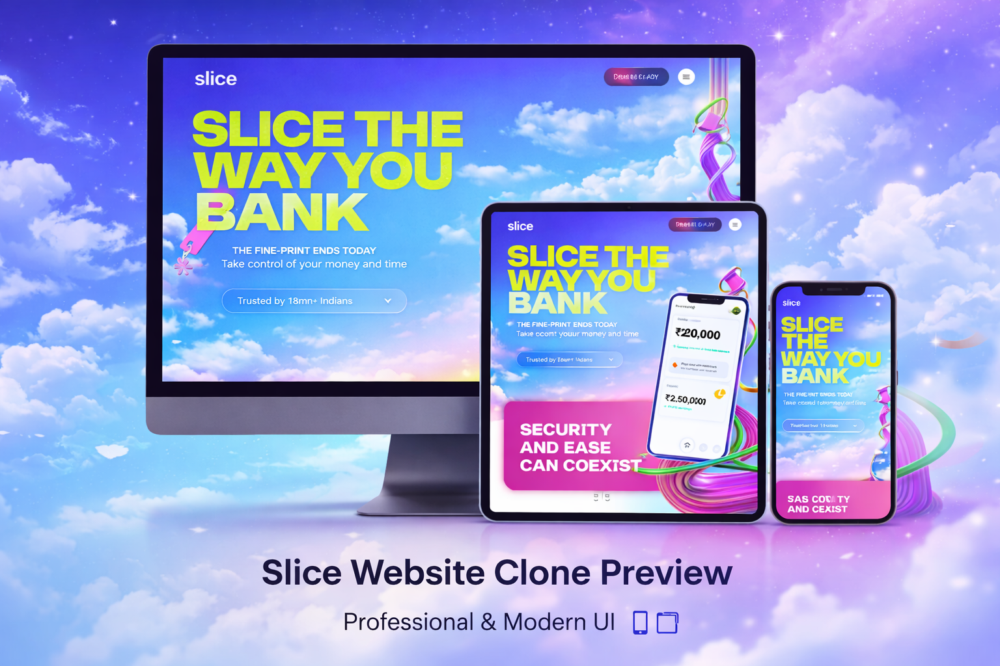

# Slice Website Clone 🚀

A **fully responsive front-end clone of the Slice website**, built using **HTML5, CSS3, and modern responsive design techniques**.  
This project focuses on **pixel-perfect UI recreation**, smooth layouts, and clean, maintainable code — ideal for showcasing front-end skills to recruiters.

---

## 📸 Preview


> *Note:* Replace the image path with your actual preview image.

---

## 📂 Project Folder Structure

```bash
Slice-Clone/
│
├── index.html          # Main HTML file
├── style.css           # Core styling
├── media-query.css     # Responsive styles (Mobile / Tablet / Desktop)
├── assets/             # Images, icons, SVGs
│   ├── images/
│   └── icons/
├── README.md           # Project documentation
└── LICENSE             # License file

✨ Features

✅ Pixel-perfect UI inspired by Slice official website

✅ Fully responsive (Mobile, Tablet, Laptop & Desktop)

✅ Clean and structured HTML5

✅ Modular CSS with separate media queries

✅ Modern layout techniques (Flexbox & Grid)

✅ Optimized assets for better performance


🛠️ Technologies Used

HTML5

CSS3

Flexbox

CSS Grid

Media Queries

Responsive Design Principles


📱 Responsive Design

The website adapts seamlessly across devices:

📱 Mobile (max-width: 767px)

📱 Tablet (768px – 991px)

💻 Laptop (992px – 1199px)

🖥️ Large Screens

All responsive styles are managed separately in media-query.css for better scalability.

.

🚀 Getting Started (Clone & Run Locally)

Follow these steps to run the project locally:

# Clone the repository
git clone https://github.com/your-username/slice-clone.git

# Navigate to project folder
cd slice-clone

# Open index.html in browser

Or simply open index.html using Live Server in VS Code.

📌 What I Learned

Building real-world website layouts

Handling complex responsive UI

Writing scalable and reusable CSS

Structuring large front-end projects

Improving UI/UX attention to detail

📞 Contact

👤 Your Name
💼 Front-End Developer
📧 Email: your-email@example.com

🔗 GitHub: https://github.com/RonitkumarSoni

🔗 LinkedIn: https://linkedin.com/in/your-profile